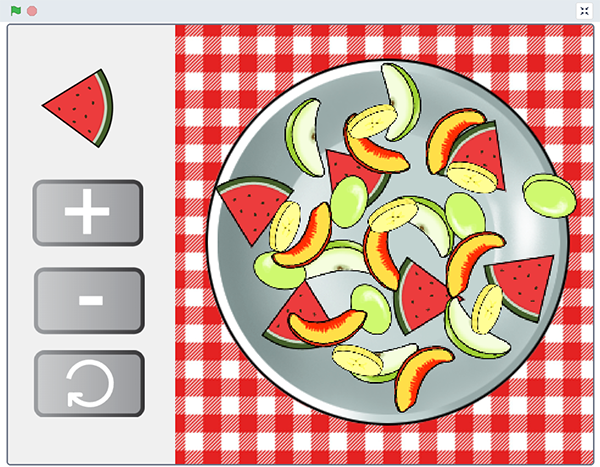

## Introduction
In this project, you will create an app for family and friends to design their own fruit salad. Preparing food and creating art are great ways to relax — the Fruit salad app lets you make food art! 

### What you will make

--- no-print ---
Click on the bowl to create stamps (copies) of the fruit that you see in the top left-hand corner.  
+ Click on the fruit to choose a different fruit. 
+ Click on the size or rotation buttons to alter the fruit before you stamp it. 
+ Think carefully before you lay out your fruit salad, because you can't move or change the stamps after you have added them! 
+ Click on the green flag to clear the bowl and start again.

  <iframe src="https://scratch.mit.edu/projects/411575753/embed" allowtransparency="true" width="485" height="402" frameborder="0" scrolling="no" allowfullscreen></iframe>

--- /no-print ---

--- print-only ---
{:width="400px"}
--- /print-only ---

--- collapse ---
---
title: What you will need
---
### Hardware

+ A computer or tablet capable of running Scratch

### Software

+ Scratch 3 (either [online](https://scratch.mit.edu/){:target="_blank"} or [offline](https://scratch.mit.edu/download){:target="_blank"})

### Downloads

+ If you are working offline, download the [project starter file](https://rpf.io/p/en/fruit-salad-go){:target="_blank"} 

--- /collapse ---

--- collapse ---
---
title: What you will learn
---

+ How to use `broadcast`{:class="block3events"} and `when I receive`{:class="block3events"} blocks to communicate between different sprites and between the Stage and a sprite
+ How to use the `Pen`{:class="block3extensions"} extension blocks to `stamp`{:class="block3extensions"} sprites
+ How to add code to the **Stage**

--- /collapse ---

--- collapse ---
---
title: Additional information for educators
---

You can [download the completed project here](https://rpf.io/p/en/fruit-salad-get){:target="_blank"}.

If you need to print this project, please use the [printer-friendly version](https://projects.raspberrypi.org/en/projects/fruit-salad/print){:target="_blank"}.

--- /collapse ---
