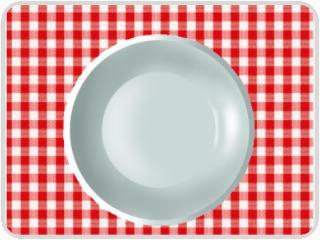
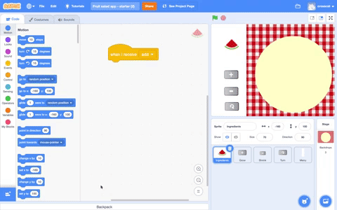
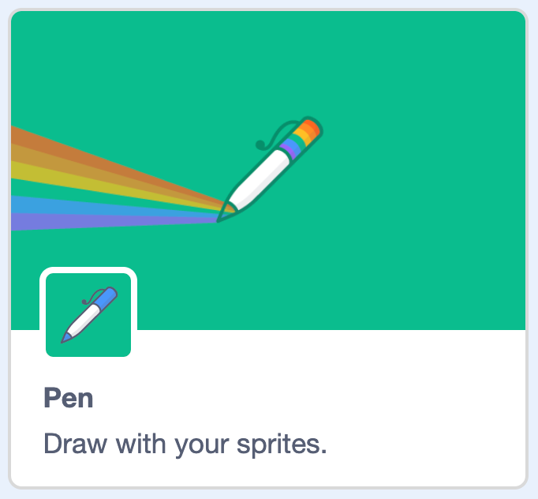

## Stamping fruit
Scratch's Extensions blocks offer additional blocks to use. For instance, the `Pen`{:class="block3extensions"} block allows you to draw and stamp images. You're going to use the `Pen`{:class="block3extensions"} extension to create stamps of a fruit sprite. 

A stamp is a copy of the sprite which you can't move or delete once you've stamped it.

--- task ---

First open the Fruit salad starter project.  

If working **online**, open the [starter project](http://rpf.io/fruit-salad-on){:target="_blank"} in Scratch.
 
If working **offline**, open the project [starter file](http://rpf.io/p/en/fruit-salad-get){:target="_blank"} in the Scratch offline editor. If you need to download and install Scratch, you can find it [here](https://scratch.mit.edu/download){:target="_blank"}.

You will see a backdrop with a tablecloth and a bowl. There's a menu sprite on the left of the stage and a fruit sprite that has fruit costumes that you'll be able to stamp onto the bowl.

{:width="400px"}

--- /task ---

The project doesn't have any code so it doesn't do anything yet.

Every time you click or tap on the Stage, you want to create a stamp of one of the costumes in the **Ingredients** sprite at the location of your mouse pointer.

--- task ---

Click on the Stage and then the Code tab. 

{:width="400px"}

--- /task ---

The Stage needs a block to detect when it is clicked. 

--- task ---

Add a `when stage clicked`{:class="block3events"} block:



```blocks3
when stage clicked
```

--- /task ---

Now the Stage needs to let the Ingredient sprite know that it should add an ingredient to the plate. The `broadcast`{:class="block3events"} block sends a message which any sprite can receive. 

--- task ---

Add a `broadcast`{:class="block3events"} block:


```blocks3
broadcast [message1 v]
```

Click on `message1`{:class="block3events"} and choose `New message`{:class="block3events"} and enter 'add'. 

--- /task ---

Your code should look like this:

```blocks3
when stage clicked
broadcast [add v]
```

--- task ---
Now select the **Ingredients** sprite and click on the Code tab. 

--- no-print ---


--- /no-print ---

--- /task ---

--- task ---
Add a `when I receive`{:class="block3events"} block:


```blocks3
when I receive [add v]
```

All blocks under this block will now run when you click on the Stage.

--- /task ---

You will now need to add the `Pen`{:class="block3extensions"} extension block.

--- no-print ---



--- /no-print ---

--- task ---

Go to the extension block tab.


Select the `Pen`{:class="block3extensions"} block.

{:width="300px"}

--- /task ---

--- task ---

Then in the Code tab, select the `stamp`{:class="block3extensions"} block:

```blocks3
stamp
```
 --- /task ---
 
--- task ---
In the **Ingredients** sprite below the `when I receive [add]`{:class="block3events"} add three blocks to create a location of the mouse pointer, create a stamp
and then return the sprite location to the starting position within the menu:


```blocks3
when I receive [add]
go to (mouse-pointer v)
stamp
go to x: (-172) y: (112)
```

**Tip:** The coordinates of the `go to x: y:`{:class="block3motion"} block will have the current location of the Ingredient sprite already in them so you shouldn't need to change them.

--- /task ---

--- task ---
Try out your project by clicking on the plate to add pieces of fruit.

The **Ingredient** sprite moves from the menu to the mouse pointer, creates a stamp and then moves back to the menu, this happens quickly so you don't see it move!

You won't be able to create a stamp by clicking on the menu as the menu stops you doing this. The 'add' message only gets broadcast if you click on the Stage.

If you add a piece of fruit so that it overlaps the Stage then the stamp will automatically go behind the menu. 

**Tip:** On all projects, stamps go on top of backdrops but underneath sprites. 

--- /task ---

We need to ensure that the plate is clear at the start. 

--- task ---
Add code to the **Ingredients** sprite to clear all the stamps from the plate when the `when green flag clicked`{:class="block3events"} block.

Then go to `Pen`{:class="block3extensions"} and select the `erase all`{:class="block3extensions"} block:


```blocks3
when green flag clicked
erase all
```
--- /task ---

--- save ---

 


