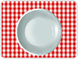
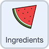

## Stamp fruit
Scratch extensions offer additional blocks to use, such as the `Pen`{:class="block3extensions"} extension blocks, which allow you to draw and stamp images. You will use the `Pen`{:class="block3extensions"} extension blocks to create stamps of a fruit sprite.

A **stamp** is a copy of the sprite, which you cannot move or delete once you have stamped it.

--- task ---

First, open the Fruit salad starter project.  

**Online:** open the [starter project](http://rpf.io/fruit-salad-on){:target="_blank"} in Scratch.

**Offline:** open the [project starter file](http://rpf.io/p/en/fruit-salad-go){:target="_blank"} in the Scratch offline editor. If you need to, you can [download and install Scratch here](https://scratch.mit.edu/download){:target="_blank"}.

You will see a backdrop with a tablecloth and a bowl. There is a **Menu** sprite on the left-hand side of the Stage and an **Ingredients** sprite that has fruit costumes that you will be able to stamp onto the bowl.

{:width="400px"}

--- /task ---

The project does not have any code, so it does not do anything yet.

You need to add code so that every time you click or tap on the Stage, you create a stamp of one of the costumes in the **Ingredients** sprite at the location of your mouse pointer.

--- task ---

Select the **Stage** and then go to the **Code** tab.

{:width="400px"}

--- /task ---

The **Stage** needs a block to detect when it is clicked.

--- task ---

Add a `when stage clicked`{:class="block3events"} block:




```blocks3
when stage clicked
```

--- /task ---


Now, the **Stage** needs to let the **Ingredients** sprite know that it should add an ingredient to the bowl.

The `broadcast message1`{:class="block3events"} block sends a message that any sprite can receive.


--- task ---

Add a `broadcast message1`{:class="block3events"} block:


```blocks3
broadcast [message1 v]
```


Click on `message1`{:class="block3events"} and choose `New message`{:class="block3events"} and enter `add`.

--- /task ---

Your code should look like this:

```blocks3
when stage clicked
broadcast [add v]
```

--- task ---
Now, select the **Ingredients** sprite and go to the **Code** tab.

--- no-print ---


--- /no-print ---

--- /task ---

--- task ---
Add a `when I receive add`{:class="block3events"} block:




```blocks3
when I receive [add v]
```

All the code under this `Events`{:class="block3events"} block will now run when you click on the Stage.

--- /task ---

Now, you need to add the `Pen`{:class="block3extensions"} extension blocks.

--- no-print ---


--- /no-print ---

--- task ---

Click the **Add Extension** button.


Select the **Pen** extension.

{:width="300px"}

--- /task ---

--- task ---


Then, in the **Code** tab, go to the **Pen** menu and add the `stamp`{:class="block3extensions"} block:

```blocks3
stamp
```
 --- /task ---

--- task ---
In the **Ingredients** sprite's code, below the `when I receive add`{:class="block3events"} block, add three blocks to tell the sprite to `go to`{:class="block3motion"} the location of the `mouse pointer`{:class="block3motion"}, create a `stamp`{:class="block3extensions"}, and then return to (`go to`{:class="block3motion"}) the starting position within the menu:


```blocks3
when I receive [add v]
go to (mouse-pointer v)
stamp
go to x: (-172) y: (112)
```

**Tip:** The coordinates of the `go to x: y:`{:class="block3motion"} block will be set to the current location of the **Ingredients** sprite already, so you should not need to change them.

--- /task ---

--- task ---
To try out your project, click on the bowl to add pieces of fruit.

The **Ingredients** sprite moves from the menu to the mouse pointer, creates a stamp, and then moves back to the menu. This happens quickly, so you don't see it move!

You will not be able to click on the menu to create a stamp because the menu stops you doing this. The `add`{:class="block3events"} message is only broadcast if you click on the Stage.

If you add a piece of fruit that overlaps the Stage, the stamp will automatically go behind the menu.

**Tip:** In all projects, stamps go on top of backdrops, but underneath sprites.

--- /task ---

You need to ensure that the bowl is clear at the start.

--- task ---

Add code to the **Ingredients** sprite to clear all the stamps from the bowl `when green flag clicked`{:class="block3events"}.

In the **Ingredients** sprite's **Code** tab, add a `when green flag clicked`{:class="block3events"} block. Then, from the `Pen`{:class="block3extensions"} blocks menu, add an `erase all`{:class="block3extensions"} block:


```blocks3
when green flag clicked
erase all
```
--- /task ---

--- save ---
