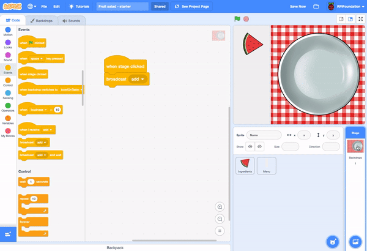

## Stamping fruit
Scratch's Extensions blocks offers additional block to use. For instance, the `Pen`{:class="block3extensions"} block allows you to draw and stamp (copy) images. You're going to use the `Pen`{:class="block3extensions"} extension to create 'stamps' of a fruit sprite. 

A stamp is a copy of the sprite which you can't move once you've stamped it.

--- task ---

First open the Fruit salad starter project. You will see a backdrop with a tablecloth and a plate. There's a menu sprite on the left of the stage and a fruit sprite that has fruit costumes that you'll be able to stamp onto the plate. 

If working **online**, open the [starter project](http://rpf.io/fruit-salad-on){:target="_blank"} in Scratch.
 
If working **offline**, open the project [starter file](http://rpf.io/p/en/serene-scene-get){:target="_blank"} in the Scratch offline editor. If you need to download and install Scratch, you can find it [here](https://scratch.mit.edu/download){:target="_blank"}.

{:width="400px"}

--- /task ---

The project doesn't have any code so it doesn't do anything yet.

Every time you click or tap on the Stage, you want to create a stamp of one of the costumes in the **Ingredients** sprite at the location of your mouse pointer.

--- task ---

Click on the Stage and then the Code tab. 

{:width="400px"}

{:width="400px"}

--- /task ---

The Stage needs a block to detect when it is clicked. 

--- task ---

Add a `when stage clicked` block:

```blocks3
when stage clicked
```

--- /task ---

Now the Stage needs to let the Ingredient sprite know that it should add an ingredient to the plate. The `broadcast` block sends a message which any sprite can receive. 

--- task ---

Add a `broadcast` block:

```blocks3
broadcast [message1 v]
```

Click on `message1` and choose `New message` and enter 'add'. 

--- /task ---

Your code should look like this:

```blocks3
when stage clicked
broadcast [add v]
```

--- task ---
Now select the Ingredient sprite and click on the Code tab. 

{:width="400px"}
{:width="400px"}

Add a `when I receive` block:

```blocks3
when I receive [add]
```

The blocks under this block will run when you click on the stage.

--- /task ---

--- task ---
Click 'Add extension' and choose the Pen extension. 


--- /task ---

You will see a new Pen section in the Code tab. 


--- task ---
Add blocks under the `when I receive [add]` to move the Ingredient sprite to the location of the mouse pointer and create a stamp, then return to the starting position:

```blocks3
when I receive [add]
go to (mouse-pointer v)
stamp
go to x: (-160) y: (100)
```

**Tip:** The coordinates of the `go to x: y:` block will have the current location of the Ingredient sprite already in them so you shouldn't need to change them.
--- /task ---

--- task ---
Try out your project by clicking on the plate to add pieces of fruit.

The Ingredient sprite moves from the menu to the mouse pointer, creates a stamp and then moves back to the menu, this happens quickly so you don't see it move!

You won't be able to create a stamp by clicking on the menu because the 'add' message only gets broadcast if you click on the stage and the menu stops you doing this. 

If you add a piece of fruit so that it would overlap the stage then the stamp will go behind the menu. 

**Tip:** Stamps go on top of the backdrop but underneath the sprites. 

--- /task ---

--- task ---
The `erase all` block removes stamps. 

Add code to the Ingredients sprite to clear the plate when the green flag is clicked. 

```blocks3
when green flag clicked
erase all
--- /task ---

--- save ---

 


