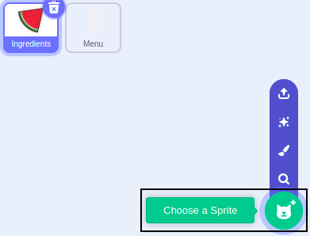

## Grow and shrink
Not all pieces of fruit are the same size. Now you're going to add buttons to grow and shrink your ingredient before adding it. 

--- task ---
To add a button sprite go to Choose a Sprite.

{:width="300px"}

Search for Button3 by typing 'Button3' in the search menu and select it.

{:width="300px"}

--- /task ---

You will now see button sitting in the Stage area. You need to move the button otherwise someone may eat it!

--- no-print ---
.

--- /no-print ---

--- task ---

Drag the button from the plate to the menu area on the left-hand side of the screen.

--- /task ---

--- task ---

Change the name of 'Button3' to **Grow** sprite.

--- /task ---

--- task ---

Click on **Grow** sprite's Costumes tab. 

{:width="300px"}

Choose the Text tool and select any Fill colour you like. 

{:width="300px"}

Add a '+' symbol to your button by selecting the 'plus' key on your keyboard.

Use the 'handles' to make the '+' the right size for your button. 

{:width="300px"}

--- /task ---

--- task ---
Switch back to the Code tab. 

--- /task ---

--- task ---
Drag the button into position and resize it. 

--- /task ---

--- task ---

Add code to the new button to broadcast a 'grow' message when it is clicked. 

```blocks3
when this sprite clicked
broadcast grow
```
--- /task ---

--- task ---
Select the Ingredients sprite and add code to grow the sprite:

```blocks3
when I receive [grow v]
change size by (10)
```
--- /task ---

--- task ---
Try your project out and make sure you can grow your pieces of fruit before stamping them. 
--- /task ---

--- task ---
Add another Button 3 and use the text tool to add a '-' symbol to it.
--- /task ---

--- task ---
Position and resize your new button. 
--- /task ---

--- task --- 
Add code to your Shrink button to broadcast a 'shrink' event when it is clicked.

--- /task ---

--- task ---
Add code to the **Ingredient** sprite to shrink when it receives a 'shrink' message:

```blocks3
when I receive [grow v]
change size by (-10)
```
--- /task ---

--- task ---
Take some time to enjoy your project and design a fruit salad. 
--- /task ---

--- save ---


