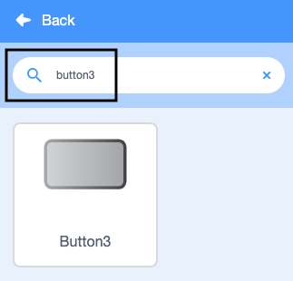
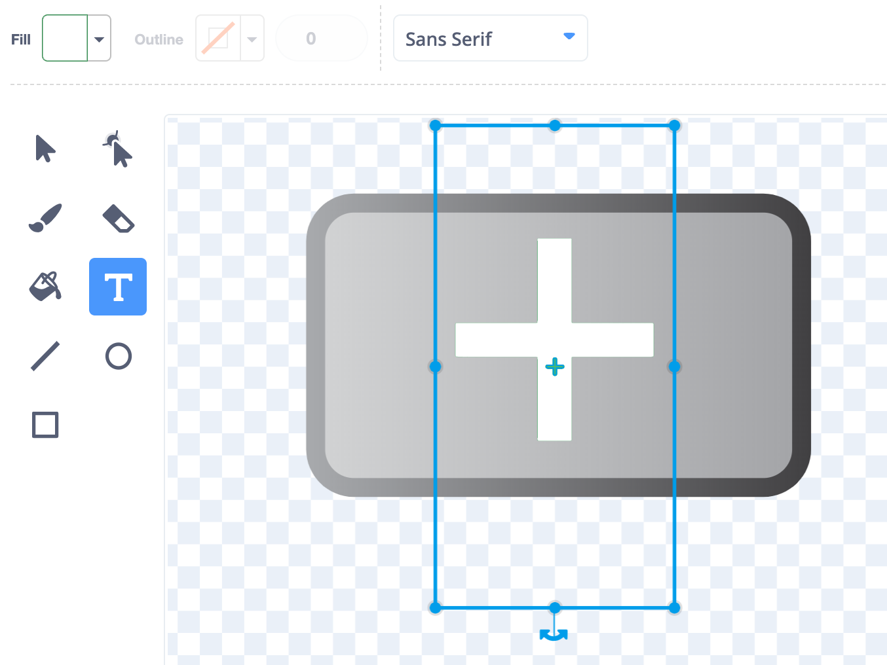

## Add a Grow button
Not all pieces of fruit are the same size. In this step, you will add a button to grow your ingredients before you add them. 

--- task ---
To add a button sprite, click on **Choose a Sprite**.

{:width="400px"}

Type `Button3` into the search bar. Select **Button3**.

{:width="400px"}

--- /task ---

You will now see the button on the Stage. You need to move the button off the bowl, otherwise someone may eat it!

--- no-print ---
.

--- /no-print ---

--- task ---

Drag the button from the bowl into position in the menu area on the left-hand side of the Stage.

--- /task ---

--- task ---

Change the name of the **Button3** sprite. Click on the dialogue box that shows the sprite’s name. Replace `Button3` with the new name, `Grow`.


--- /task ---

--- task ---

Click on the **Grow** sprite's **Costumes** tab. 

{:width="400px"}

Choose the **Text** tool and select any **Fill** colour you like. 

{:width="100px"}

Add a `+` symbol to your button. To do this, press the <kbd>+</kbd> key on your keyboard.

Use the blue handles around the button to alter the size of the `+` symbol. Make sure that the `+` symbol fits within the button and can be seen clearly. 

{:width="400px"}

--- /task ---

Now, you need to add some code to the **Grow** sprite.

--- task ---
Switch back to the **Grow** sprite's **Code** tab and add the following code to `broadcast`{:class="block3events"} a `grow` message `when the sprite is clicked`{:class="block3events"}:


```blocks3
when this sprite clicked
broadcast [grow v]
```
--- /task ---

Now, you need to add some code to the **Ingredients** sprite so that it can receive the message to grow from the **Grow** sprite.

--- task ---

Select the **Ingredients** sprite and add the following code to enable it to grow:


```blocks3
when I receive [grow v]
change size by (5)
```
--- /task ---

Set the **Ingredients** sprite back to the original size each time you choose a new fruit costume. 

--- task ---

The **Ingredients** sprite is set to a starting size of `25`%. Find your existing `when this sprite clicked`{:class="block3events"} script and add a `set size to`{:class="block3looks"} block with the value `25`% to reset the size each time the costume changes:


```blocks3
when this sprite clicked
+ set size to (25) %
next costume
```
--- /task ---

--- task ---
Run your program. Make sure that you can grow your pieces of fruit before you stamp them and check that they return to the original size each time you choose a new fruit costume. 

--- /task ---

--- save ---

