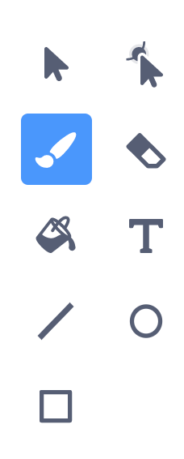
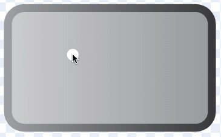

## Add a Rotate button
At the moment, each piece of fruit faces in the same direction, which will limit the design that users can create with your fruit salad app. To improve your app, you will add a **Rotate** button that users can click to rotate the ingredient before they stamp it.

--- task ---
Create a **Rotate** button sprite. To do this, select a **Button3** sprite once more.

Drag the new button to below the **Grow** and **Shrink** buttons in the menu.

Rename it `Rotate`.

--- /task ---

--- task ---
Click on the **Rotate** sprite's **Costumes** tab.

Select the **Brush** tool.

{:width="150px"}

Adjust the **Fill** colour. 

Draw an arrow on the button. 

--- no-print ---


--- /no-print ---

**Tip:** If you make a mistake, click on **Undo** and then have another go.


--- /task ---

--- task ---
Now add a new script, `when the sprite is clicked`{:class="block3events"}, so that **Rotate** sprite `broadcasts`{:class="block3events"} a `rotate` message:

```blocks3
when this sprite clicked
broadcast [rotate v]
```
--- /task ---

--- task ---
Now, add another new script this time to the **Ingredients** sprite. Click on the **Code** tab. Add a `when I receive rotate`{:class="block3events"} block and a `turn left`{:class="block3motion"} block to rotate the **Ingredients** sprite when it receives a message to rotate. 

```blocks3
when I receive [rotate v]
turn [45] degrees :: motion
```

You do not have to rotate the ingredients 45 degrees each time the **Rotate** button is clicked. You can choose any angle of rotation. 
--- /task ---

--- task ---
Try your project again. Choose an ingredient, rotate it, stamp it as many times as you like, and keep adding ingredients to create a fruit salad. What patterns can you create with fruit?

--- /task ---

--- save ---
